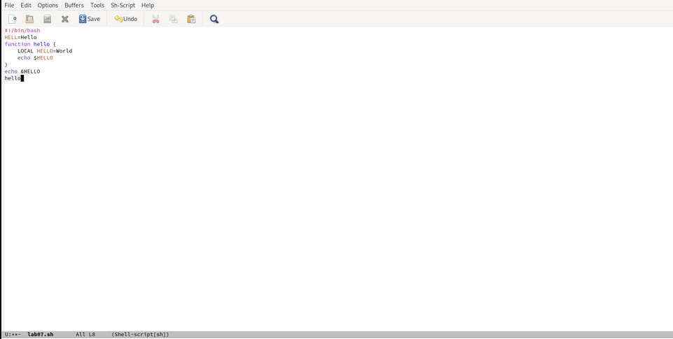

---
## Front matter
title: "Лабораторная работа №9"
subtitle: "Операционные системы"
author: "Иовков Мирослав Алексеевич"

## Generic otions
lang: ru-RU
toc-title: "Содержание"

## Bibliography
bibliography: bib/cite.bib
csl: pandoc/csl/gost-r-7-0-5-2008-numeric.csl

## Pdf output format
toc: true # Table of contents
toc-depth: 2
lof: true # List of figures

fontsize: 12pt
linestretch: 1.5
papersize: a4
documentclass: scrreprt
## I18n polyglossia
polyglossia-lang:
  name: russian
  options:
	- spelling=modern
	- babelshorthands=true
polyglossia-otherlangs:
  name: english
## I18n babel
babel-lang: russian
babel-otherlangs: english
## Fonts
mainfont: PT Serif
romanfont: PT Serif
sansfont: PT Sans
monofont: PT Mono
mainfontoptions: Ligatures=TeX
romanfontoptions: Ligatures=TeX
sansfontoptions: Ligatures=TeX,Scale=MatchLowercase
monofontoptions: Scale=MatchLowercase,Scale=0.9
## Biblatex
biblatex: true
biblio-style: "gost-numeric"
biblatexoptions:
  - parentracker=true
  - backend=biber
  - hyperref=auto
  - language=auto
  - autolang=other*
  - citestyle=gost-numeric
## Pandoc-crossref LaTeX customization
figureTitle: "Рис."
tableTitle: "Таблица"
listingTitle: "Листинг"
lofTitle: "Список иллюстраций"
lotTitle: "Список таблиц"
lolTitle: "Листинги"
## Misc options
indent: true
header-includes:
  - \usepackage{indentfirst}
  - \usepackage{float} # keep figures where there are in the text
  - \floatplacement{figure}{H} # keep figures where there are in the text
---

# Цель работы

Познакомиться с операционной системой Linux.Получить практические навыки работы с редактором emacs

# Задание
   Открыть emacs.
   Cоздать файл lab07.sh с помощью комбинации Ctrl-x Ctrl-f (C-x C-f).

    Наберите текст:

1 #!/bin/bash

2 HELL=Hello

3 function hello {

4 LOCAL HELLO=World

5 echo $HELLO

6 }

7 echo $HELLO

8 hello

    Сохранить файл с помощью комбинации Ctrl-x Ctrl-s (C-x C-s).

    Проделать с текстом стандартные процедуры редактирования,каждое действие долж- но осуществляться комбинацией клавиш.

5.1. Вырезать одной командой целую строку (С-k).

5.2. Вставить эту строку в конец файла (C-y).

5.3. Выделить областьтекста (C-space).

5.4. Скопировать область в буфер обмена (M-w).

5.5. Вставить область в конец файла.

5.6. Вновь выделить эту область и на этотраз вырезать её (C-w).

5.7. Отмените последнее действие (C-/).

    Научитесь использовать команды по перемещению курсора.

6.1. Переместите курсор в начало строки (C-a).

6.2. Переместите курсор в конец строки (C-e).

6.3. Переместите курсор в начало буфера (M-<).

6.4. Переместите курсор в конец буфера (M->).

    Управление буферами.

7.1. Вывести список активных буферов на экран (C-x C-b)

7.2. Переместитесь во вновь открытое окно (C-x) o со списком открытых буферов и переключитесь на другой буфер.

7.3. Закройте это окно (C-x 0).

7.4. Теперь вновь переключайтесь между буферами,но уже без вывода их списка на экран (C-x b).

    Управление окнами.

8.1. Поделите фрейм на 4 части: разделите фрейм на два окна по вертикали (C-x 3), а затем каждое из этих окон на две части по горизонтали (C-x 2)

8.2. В каждом из четырёх созданных окон откройте новый буфер (файл) и введите несколько строктекста.

    Режим поиска

9.1. Переключитесьв режим поиска (C-s) и найдите несколько слов,присутствующих втексте.

9.2. Переключайтесь между результатами поиска,нажимая C-s.

9.3. Выйдите из режима поиска,нажав C-g.

9.4. Перейдите в режим поиска и замены (M-%),введитетекст,который следует найти и заменить,нажмите Enter ,затем введитетекстдля замены.Послетого как будут подсвечены результаты поиска,нажмите ! для подтверждения замены.

9.5. Испробуйте другой режим поиска,нажав M-s o.Объясните,чем он отличается от обычного режима?

# Выполнение лабораторной работы

Открыл emacs

{#fig:001 width=70%}

Создал файл lab07.sh с помощью комбинации Ctrl-x Ctrl-f (C-x C-f)

{#fig:002 width=70%}

3.Набрал текст:(рис. [-@fig:003])

1 #!/bin/bash

2 HELL=Hello

3 function hello {

4 LOCAL HELLO=World

5 echo $HELLO

6 }

7 echo $HELLO

8 hello

{#fig:003 width=70%}

  Сохранил файл с помощью комбинации Ctrl-x Ctrl-s (C-x C-s).

  Проделал с текстом стандартные процедуры редактирования, каждое действие осуществлялось комбинацией клавиш.

5.1. Вырезал одной командой целую строку (С-k).

{#fig:004 width=70%}

Вставил эту строку в конец файла (C-y)

{#fig:005 width=70%}
Выделил область текста (C-space).

{#fig:006 width=70%}
Скопировал область в буфер обмена (M-w).(рис. [-@fig:007])

5.5. Вставил область в конец файла.

{#fig:007 width=70%}
Вновь выделил эту область и на этот раз вырезал её (C-w).

{#fig:008 width=70%}

Отменил последнее действие (C-/)

{#fig:009 width=70%}

    Научился использовать команды по перемещению курсора.

6.1. Переместил курсор в начало строки 
{#fig:010 width=70%}
Переместил курсор в конец строки
{#fig:011 width=70%}
Переместил курсор в начало буфера (M-<), а также переместил курсор в конец буфера (M->).

    Управление буферами.

7.1. Вывел список активных буферов на экран (C-x C-b)

{#fig:012 width=70%}

7.2. Переместился во вновь открытое окно (C-x) o со списком открытых буферов и переключился на другой буфер.

{#fig:013 width=70%}

7.3. Закрыл это окно (C-x)

{#fig:014 width=70%}

Вновь переключился между буферами, но без вывода их списка на экран (C-x b).

    Управление окнами.

8.1. Поделил фрейм на 4 части: разделил фрейм на два окна по вертикали

(C-x 3), а затем каждое из этих окон на две части по горизонтали (C-x 2)

{#fig:015 width=70%}

8.2. В каждом из четырёх созданных окон открыл новый буфер (файл) и ввел несколько строк текста.

{#fig:016 width=70%}

    Режим поиска

9.1. Переключился в режим поиска (C-s) и нашел несколько слов, присутствующих в тексте

{#fig:017 width=70%}

9.2. Переключался между результатами поиска, нажимая C-s.

{#fig:018 width=70%}

9.3. Вышел из режима поиска, нажав C-g.

{#fig:019 width=70%}

9.4. Перешел в режим поиска и замены (M-%), ввела текст, который следует найти и заменить, нажала Enter , затем ввела текст для замены. После того как были подсвечены результаты поиска, нажала ! для подтверждения замены.

Cкрин со старого устройства

{#fig:020 width=70%}

9.5. Испробовал другой режим поиска, нажав M-s o. Он отличается от обычного режима тем, что при поиске указывает номера строк в которых найдено введённое слово и выделяет их цветом. В обычном режиме выделение цветом появляется, только когда нужно подтвердить замену.
# Выводы

Познакомился с операционной системой Linux, получил практические навыки работы с редактором Emacs.

# Контрольные вопросы

    Кратко охарактеризуйте редактор emacs.

    Какие особенности данного редактора могутсделать его сложным для освоения но- вичком?

    Своими словами опишите,чтотакое буфер и окно втерминологии emacs’а.

    Можно ли открыть больше 10 буферов в одном окне?

    Какие буферы создаются по умолчанию при запуске emacs?

    Какие клавиши вы нажмёте,чтобы ввести следующую комбинацию C-c | и C-c C-|?

    Как поделитьтекущее окно на две части?

    В каком файле хранятся настройки редактора emacs?

    Какую функцию выполняет клавиша и можно ли её переназначить?

    Какой редактор вам показался удобнее в работе vi или emacs? Поясните почему.

#Ответы на вопросы

    Emacs представляет собой мощный экранный редактор текста, написанный на языке высокого уровня Elisp.

    Развитие Emacs в сторону его многогранности послужило причиной того, что и без того интуитивно непонятная программа стала чрезвычайно сложной в применении. В частности, управление осуществляется при помощи различных клавиатурных комбинаций, запомнить которые будет непросто.

    Буфер – что-то, состоящее из текста. Окно – область с одним из буферов.

    В одном окне можно открыть больше 10 буферов.

    После запуска emacs без каких-либо параметров в основном окне отображается буфер scratch, который используется для оценки выражений Emacs Lisp, а также для заметок, которые вы не хотите сохранять. Этот буфер не сохраняется автоматически.

    Чтобы ввести следующую комбинацию C-c | я нажму клавиши: Control+c и Shift+, и для C-c C-|: Control+c и Control+Shift+.

    Поделить текущее окно на две части можно двумя комбинациями клавиш: C-x 3 или C-x 2.

    Настроить или расширить Emacs можно написав или изменив файл ~/.emacs.

    Клавиша  выполняет функцию перемещения курсора в открытом окне также, как и многие другие клавиши её можно переназначить.

    Редактор emacs показался мне удобнее из-за возможности открытия нескольких окон с буферами и работать комбинациями клавиш в этот редакторе мне было проще.

